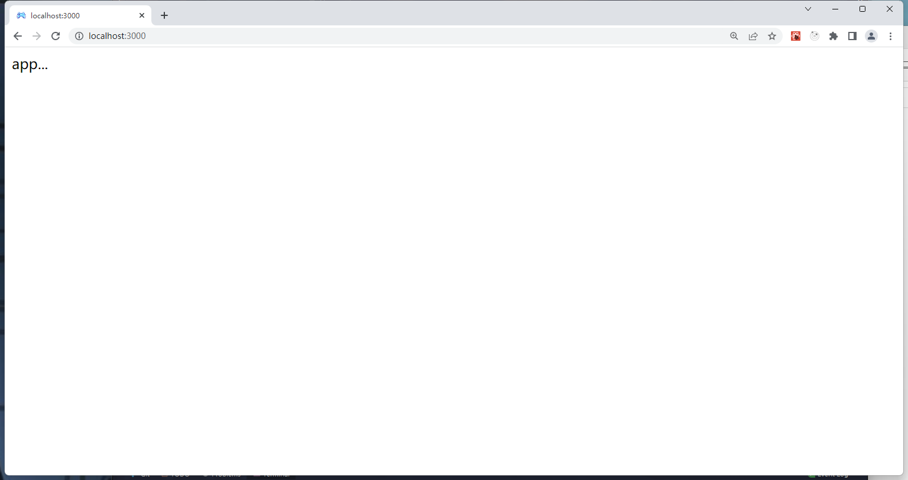
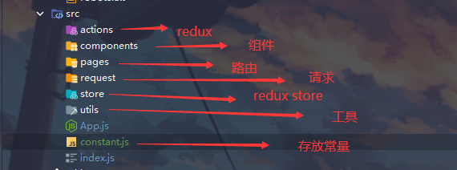
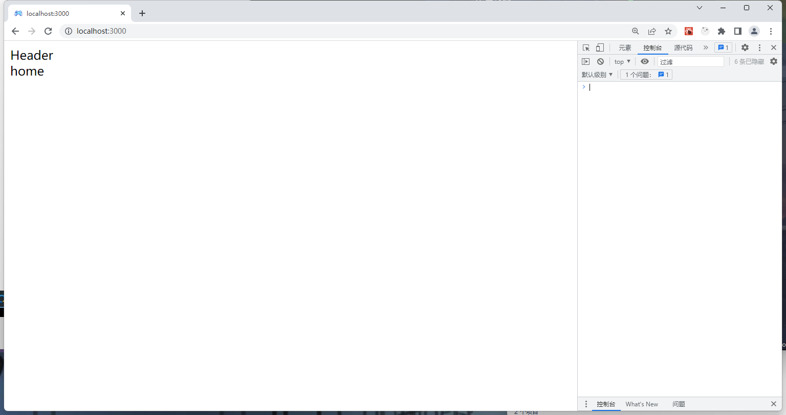
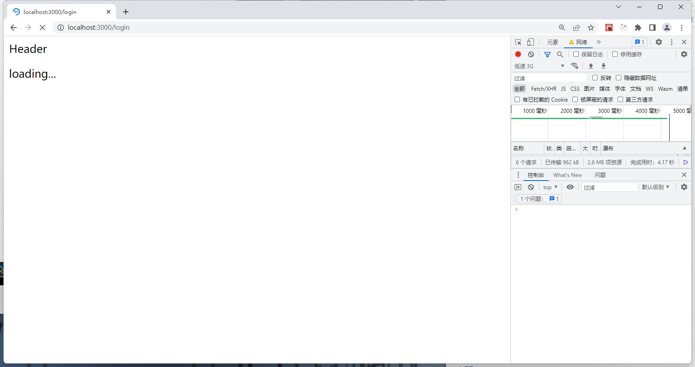
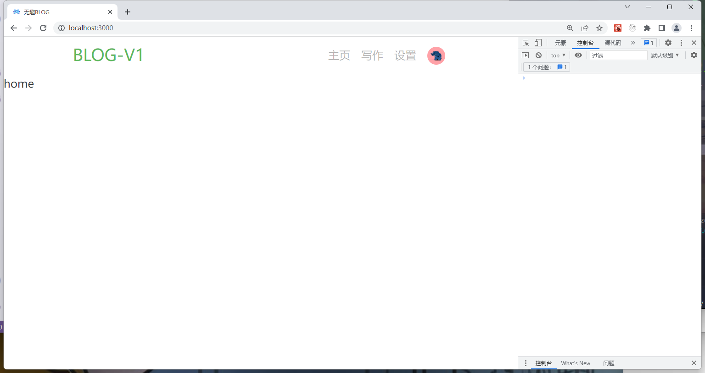
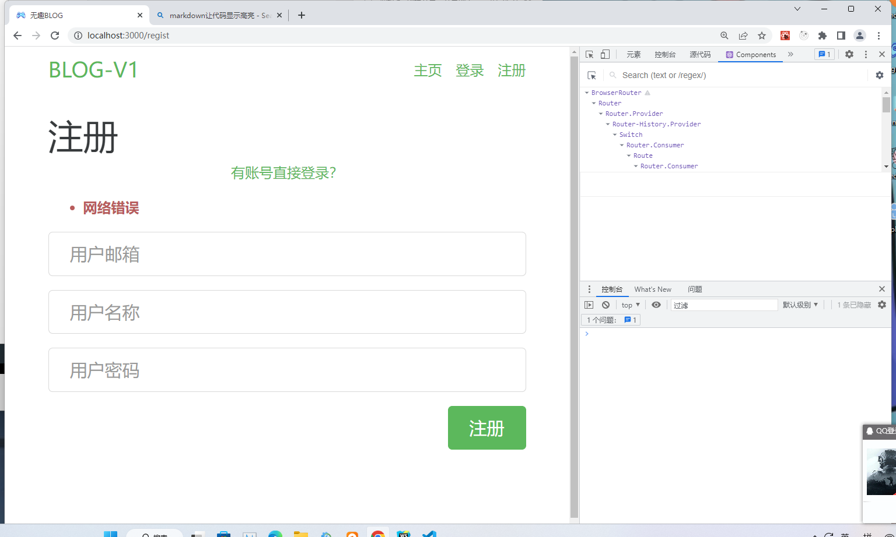
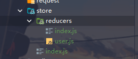

# 前端笔记

## 一 项目搭建和头部组件

### 1.项目搭建

> 1. 先引入后端服务文件,进入backend目录,使用`npm i`命令下载后端相关依赖
> 2. 回到项目根目录,使用 `create-react-app frontend`命令创建react项目
> 3. 使用`npm uninstall @testing-library/jest-dom @testing-library/react @testing-library/user-event`命令将内部的测试依赖卸载
> 4. 使用`npm i react@17 react-dom@17` 下载react17版本依赖
> 5. src目录内只留下`APP.js` 与`index.js` 删除其他文件,并将这两个文件内容修改成为如下形式

- src/APP.js

```javascript
function App() {
    return (
        <div className="App">
            app...
        </div>
    );
}

export default App;

```

- src/index.js

```javascript

import React from 'react';
import ReactDOM from 'react-dom';
import App from './App';

ReactDOM.render(<App/>, document.getElementById('root'));

```

> 6. public目录只保留`favicon.ico` 与 `index.html` 其余删除,将`index.html`文件内容保留如下形式

- public/index.html

```html
<!DOCTYPE html>
<html lang="en">
<head>
    <meta charset="utf-8"/>
    <link rel="icon" href="%PUBLIC_URL%/favicon.ico"/>
    <meta name="viewport" content="width=device-width, initial-scale=1"/>
    <meta name="theme-color" content="#000000"/>
    <meta name="description" content="Web site created using create-react-app"/>
</head>

<div id="root"></div>

</body>
</html>
```

> 7. 使用`npm start`启动前端服务, [如果有yarn环境可以使用`yarn start` 启动也是可以地, 如果是两个环境都有,建议使用npm或yarn的一种进行依赖下载,否则可能会出现找不到依赖的情况]

- 启动服务页面展示  
  

> 8. 新建一个终端使用`npm i react-router-dom@5` 命令下载5版本的路由

> 9. 在src目录下创建以下文件夹 以及 文件  
     
> 10. 使用路由

- src/index.js

```jsx
import React from 'react';
import ReactDOM from 'react-dom';
import App from './App';
import {BrowserRouter, Route, Switch} from 'react-router-dom'

ReactDOM.render(
    <BrowserRouter>
        <Switch>
            <Route path={'/'} component={App}/>
        </Switch>
    </BrowserRouter>,
    document.getElementById('root')
);
```

> 11. 在`components` 与 `pages` 创建如下文件夹以及文件  
      

- 新建文件内容如以下形式,记得修改 ***类名***
- src/components/Header/index.jsx

```jsx
import React, {Component} from 'react';

export default class Header extends Component {

    state = {};

    render() {
        return (
            <nav>
                Header
            </nav>
        )
    }
}

```

> 12. 在`src/App.js`中使用这些组件以及路由

- src/App.js

```jsx
import {Switch, Route} from 'react-router-dom'
import Header from "./components/Header"
import Home from './pages/Home'
import Login from './pages/Login'

function App() {
    return (
        <div className="App">
            {/*  公共组件*/}
            <Header/>
            {/*主体 */}
            <Switch>
                <Route path={'/'} component={Home} exact/>{/*exact 表示精确匹配*/}
                <Route path={'/login'} component={Login} exact/>
            </Switch>
        </div>
    );
}

export default App;

```

- 效果展示
    - `http://localhost:3000`  
      
    - `http://localhost:3000/login`  
      

> 13. 优化: 使用`PureComponent`代替使用`Component`
>   - `PureComponent`的作用
      >

- 当使用`Component`时,使用`setState()`进行更改时会调用`render`函数引发更新; 如果更新后的`state`与更新前的`state`是相同的,那么此次更新是不必要的,使用`PureComponent`
  如果组件状态没有改变就不会引发更新. 这种减少渲染次数的优化可以明显提升应用程序性能和体验。

- 把所有使用Component的文件做如下更改
- 如 `src/components/Header/index.jsx`

```jsx
+
import React, {PureComponent} from 'react';

+
export default class Header extends PureComponent {

    state = {};

    render() {
        return (
            <nav>
                Header
            </nav>
        )
    }
}
```

> 14. 路由懒加载  
      > React路由懒加载的作用  
      > React路由懒勋加载的主要作用是在页面切换时按需加载模块，只有在这个模块真正被用到时才会将其加载进来。这样可以减少2种开销：  
      > 减少JavaScript包体积，即减少应用启动加载所必须加载的JavaScriptAPI或组件文件体积，提高加载速度。  
      > 减少网络流量，增强用户体验，避免在网络初始慢的情况下前端性能低下。

- src/App.js

```jsx
+
import {lazy, Suspense, memo} from 'react';
import {Switch, Route} from 'react-router-dom'
import Header from "./components/Header"
import Home from './pages/Home'

+
const Login = lazy(() => import("./pages/Login"))
    +
const Regist = lazy(() => import("./pages/Regist"))

function App() {
    return (
        <div className="App">
            {/*  公共组件*/}
            <Header/>
            {/*主体 */}
            + <Suspense fallback={<p>loading...</p>}>
            <Switch>
                <Route path={'/'} component={Home} exact/>{/*exact 表示精确匹配*/}
                <Route path={'/login'} component={Login} exact/>
                <Route path={"/regist"} component={Regist} exact/>
            </Switch>
            + </Suspense>
        </div>
    );
}

+
export default memo(App);

```

- 效果展示  
  

> 15. 终端进入`backend`目录,使用`npm start`命令运行后端服务,修改前端`public/index.html`,将样式引入到前端index.html文件中

- public/index.html

```html
<!DOCTYPE html>
<html lang="en">
<head>
    <meta charset="utf-8"/>
    <link rel="icon" href="%PUBLIC_URL%/favicon.ico"/>
    <meta name="viewport" content="width=device-width, initial-scale=1"/>
    <meta name="theme-color" content="#000000"/>
    <meta name="description" content="Web site created using create-react-app"/>
    <title>无趣BLOG</title>
    +
    <link rel="stylesheet" href="http://localhost:8000/main.css">
</head>

<div id="root"></div>

</body>
</html>

```

> 16. 在`src/components/Header`创建Menu组件,并在Header中引用,给整个Header部分添加内容

- src/components/Header/Menu.jsx

```jsx
import {memo} from "react";
import {Link} from "react-router-dom";

const Menu = memo(props => {
    const {currentUser} = props
    if (currentUser) {
        return (
            <ul className="nav navbar-nav pull-xs-right">
                <li className="nav-item">
                    <Link to={"/"} className="nav-link">
                        主页
                    </Link>
                </li>
                <li className="nav-item">
                    <Link to={"/article/new"} className="nav-link">
                        写作
                    </Link>
                </li>
                <li className="nav-item">
                    <Link to={"/setting"} className="nav-link">
                        设置
                    </Link>
                </li>
                <li className="nav-item">
                    <Link to={`/profile/${currentUser.username}`} className="nav-link">
                        
                    </Link>
                </li>
            </ul>
        )
    } else {
        return (
            <ul className="nav navbar-nav pull-xs-right">
                <li className="nav-item">
                    <Link to={"/"} className="nav-link">
                        主页
                    </Link>
                </li>
                <li className="nav-item">
                    <Link to={"/login"} className="nav-link">
                        登录
                    </Link>
                </li>
                <li className="nav-item">
                    <Link to={"/regist"} className="nav-link">
                        注册
                    </Link>
                </li>
            </ul>
        )
    }
})

export default Menu

```

- src/components/Header/index.jsx

```jsx

import React, {PureComponent} from 'react';
import {Link} from "react-router-dom";
import Menu from "./Menu";

let currentUser = {avatar: null}

export default class Header extends PureComponent {

    state = {};

    render() {
        return (
            <nav className="navbar navbar-light">
                {/*左侧*/}
                <div className="container">
                    <Link to={'/'} className="navbar-brand">
                        BLOG-V1
                    </Link>
                    {/*右侧*/}
                    <Menu currentUser={currentUser}/>
                </div>
            </nav>
        )
    }
}
```

- 效果展示  
  

# 使用redux完成注册

> 1. 在`src/pages` 内创建`AritcleNew` `Profile` `Setting` 文件夹,并在这些文件夹内添加如以下内容

- src/pages/Profile/index.jsx

```jsx
import React, {PureComponent} from 'react';

export default class Profile extends PureComponent {

    state = {};

    render() {
        return (
            <div>
                Profile
            </div>
        )
    }
}
```

> 2. 在`App.js`中使用这些路由

- App.js

```jsx

import {lazy, Suspense, memo} from 'react';
import {Switch, Route} from 'react-router-dom'
import Header from "./components/Header"
import Home from './pages/Home'


const Login = lazy(() => import("./pages/Login"))
const Regist = lazy(() => import("./pages/Regist"))
    +
const ArticleNew = lazy(() => import('./pages/AritcleNew'))
    +
const Setting = lazy(() => import('./pages/Setting'))
    +
const Profile = lazy(() => import('./pages/Profile'))

function App() {
    return (
        <div className="App">
            {/*  公共组件*/}
            <Header/>
            {/*主体 */}
            <Suspense fallback={<p>loading...</p>}>
                <Switch>
                    <Route path={'/'} component={Home} exact/>{/*exact 表示精确匹配*/}
                    <Route path={'/login'} component={Login} exact/>
                    <Route path={"/regist"} component={Regist} exact/>

                    + <Route path={'/article/new'} component={ArticleNew} exact/>{/*exact 表示精确匹配*/}
                    + <Route path={'/setting'} component={Setting} exact/>
                    + <Route path={"/profile"} component={Profile} exact/>

                </Switch>
            </Suspense>
        </div>
    );
}

export default memo(App);

```

> 3. 添加Errors组件

- src/components/Errors.js

```jsx
import React, {Component} from 'react';

const Errors = (({errors}) => {
    if (!errors) {
        return null
    }

    return (
        <ul className='error-messages'>
            <li>{errors}</li>
        </ul>
    )

})

export default Errors;
```

> 3. 为注册页面添加内容

```jsx
import React, {PureComponent} from 'react';
import {Link} from 'react-router-dom'
import Errors from '../../components/Errors'

export default class Regist extends PureComponent {
    state = {
        email: '你的邮箱',
        username: '你的名称',
        password: '',
        errors: {
            message: '网络错误'
        }
    };

    onSubmit = (e) => {
        e.preventDefault(); //阻止默认行为
    }

    changeEmail = (e) => {
        this.setState({email: e.target.value})
    }

    changeUserName = (e) => {
        this.setState({username: e.target.value})

    }

    changePassword = (e) => {
        this.setState({password: e.target.value})

    }

    render() {
        const {email, username, password, errors} = this.props
        return (
            <div className='container page'>
                <div className='row'>
                    <div className='col-md-6 offset-md-3 col-xs-12'>
                        <h1>注册</h1>
                        <p className='text-xs-center'>
                            <Link to="/login">
                                有账号直接登录？
                            </Link>
                        </p>
                        <Errors errors={this.state.errors.message}/>
                        <form onSubmit={this.onSubmit}>
                            <fieldset className='form-group'>
                                <input
                                    className='form-control form-control-lg'
                                    type="text"
                                    placeholder='用户邮箱'
                                    value={email}
                                    onChange={this.changeEmail}
                                />
                            </fieldset>
                            <fieldset className='form-group'>
                                <input
                                    className='form-control form-control-lg'
                                    type="text"
                                    placeholder='用户名称'
                                    value={username}
                                    onChange={this.changeUserName}
                                />
                            </fieldset>
                            <fieldset className='form-group'>
                                <input
                                    className='form-control form-control-lg'
                                    type="password"
                                    placeholder='用户密码'
                                    value={password}
                                    onChange={this.changePassword}
                                />
                            </fieldset>
                            <button
                                className='btn btn-lg btn-primary pull-xs-right'
                                type='submit'
                            >
                                注册
                            </button>
                        </form>
                    </div>
                </div>
            </div>
        )
    }
}

```

- 效果显示



> 5. 控制台输入命令`npm i redux history redux-thunk connected-react-router react-redux` 下载相关依赖

> 6. 在store下创建如下文件(图片所示),添加constant中的常量,在actions目录下创建user.js文件



- src/store/index.js

```js
import {legacy_createStore, applyMiddleware} from 'redux'
import thunk from "redux-thunk";
import {createBrowserHistory} from 'history'
import {routerMiddleware} from 'connected-react-router'
import createRootReducer from './reducers/index'

export const history = createBrowserHistory()
//暴露store
export const store = legacy_createStore(createRootReducer(history), applyMiddleware(routerMiddleware(history), thunk))
```

- src/constant.js

```js
//注册
export const USER_REGIST_FIELD = "USER_REGIST_FIELD"

```

- src/store/reducers/index.js

```js
import {connectRouter} from 'connected-react-router'
import {combineReducers} from 'redux'
import userReducer from "./user";

let createRootReducer = (history) => combineReducers({
    user: userReducer,
    router: connectRouter(history)
})

export default createRootReducer;
```

- src/store/reducers/user.js

```js
import * as constant from '../../constant'

const initState = {
    email: '',
    username: '',
    password: '',
    errors: null
}

const userReducer = (state = initState, action) => {
    switch (action.type) {
        case constant.USER_REGIST_FIELD:
            const key = action.key;
            const value = action.value;
            // console.log(key,value,'reducer')
            return {...state, [key]: value};
            break;
        default:
            return state;
    }
}

export default userReducer
```

- src/actions/user.js

```js
import * as constant from '../constant'

export const registFiledUpdate = (key, value) => {
    return {type: constant.USER_REGIST_FIELD, key, value}
}
```

> 7. 使用redux

- src/index.js

```jsx

import React from 'react';
import ReactDOM from 'react-dom';
import App from './App';
+ import {Route, Switch} from 'react-router-dom'
+ import {ConnectedRouter} from 'connected-react-router'
+ import {Provider} from 'react-redux'
+ import {store, history} from "./store";

ReactDOM.render(
+     <Provider store={store}>
+        <ConnectedRouter history={history}>
            <Switch>
                <Route path={'/'} component={App}/>
            </Switch>
+        </ConnectedRouter>
+    </Provider>,
    document.getElementById('root')
);

```

- src/pages/Regist/index.jsx

```jsx
import React, {PureComponent} from 'react';
import {Link} from 'react-router-dom'
import Errors from '../../components/Errors'
+ import {connect} from "react-redux";
+ import * as action from '../../actions/user'
+ import {registFiledUpdate} from "../../actions/user";

+ class Regist extends PureComponent {

    onSubmit = (e)=>{
        e.preventDefault(); //阻止默认行为
    }

    changeEmail = (e)=>{
+        this.props.registFiledUpdate("email", e.target.value)
    }

    changeUserName = (e) =>{
+        this.props.registFiledUpdate("username", e.target.value)

    }

    changePassword = (e)=>{
+         this.props.registFiledUpdate("password", e.target.value)

    }

    render() {
+         const {email, username, password, errors} = this.props
        return (
            <div className='container page'>
                <div className='row'>
                    <div className='col-md-6 offset-md-3 col-xs-12'>
                        <h1>注册</h1>
                        <p className='text-xs-center'>
                            <Link to="/login">
                                有账号直接登录？
                            </Link>
                        </p>
                        <Errors errors={errors}/>
                        <form onSubmit={this.onSubmit}>
                            <fieldset className='form-group'>
                                <input
                                    className='form-control form-control-lg'
                                    type="text"
                                    placeholder='用户邮箱'
                                    value={email}
                                    onChange={this.changeEmail}
                                />
                            </fieldset>
                            <fieldset className='form-group'>
                                <input
                                    className='form-control form-control-lg'
                                    type="text"
                                    placeholder='用户名称'
                                    value={username}
                                    onChange={this.changeUserName}
                                />
                            </fieldset>
                            <fieldset className='form-group'>
                                <input
                                    className='form-control form-control-lg'
                                    type="password"
                                    placeholder='用户密码'
                                    value={password}
                                    onChange={this.changePassword}
                                />
                            </fieldset>
                            <button
                                className='btn btn-lg btn-primary pull-xs-right'
                                type='submit'
                            >
                                注册
                            </button>
                        </form>
                    </div>
                </div>
            </div>
        )
    }
}

+ const mapState = state =>({
+    ...state.user
+ })

+ export default connect(mapState,{registFiledUpdate})(Regist)
```
