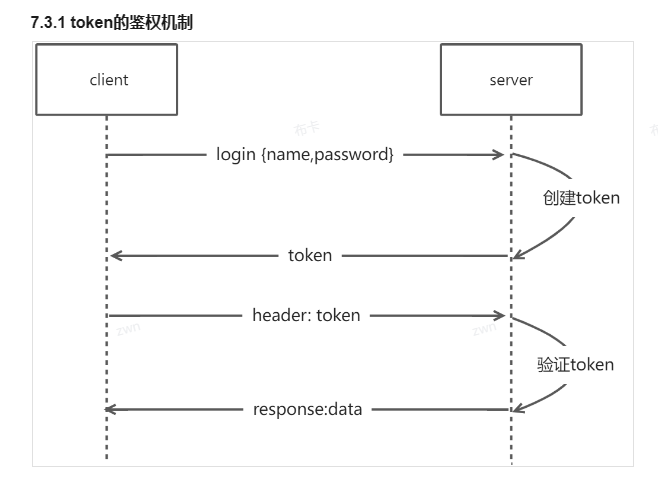
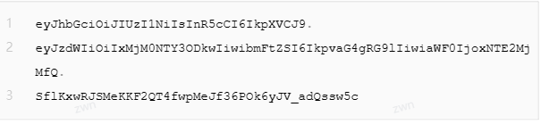

## 文件命名

1.common utils
    通用的东东 功能.类型.后缀

## 测试

1. 后端 postman postApi
2. 前端 mock 请求拦截

# jwt加签和解签

##token的鉴权机制

- 创建toke: 通过密钥secret对用户信息进行加签
- 验证token:通过密钥secret对token进行解签

## token组成分析

Header.Payload.Signature  
  

- Header(头部): base64UrlEncode(header) header(JWT的元数据:签名的算法,令牌类型)
- Payload(负载): base64UrlEncode(payload)存放实际需要传递的数据
- Signature(签名): HMACSHA256(base64UrlEncode(header)+'.'+base64UrlEncode(payload),secret)

